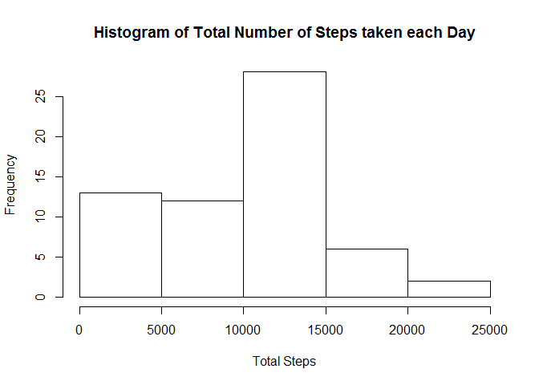
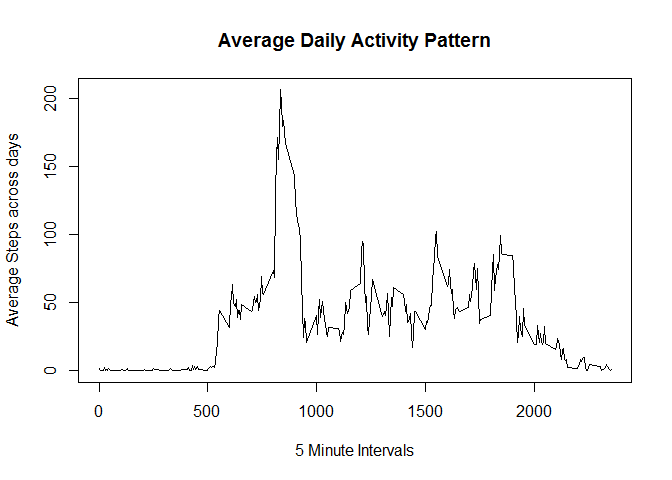
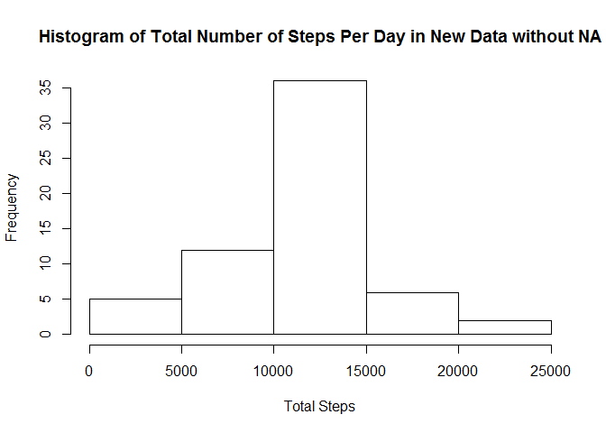
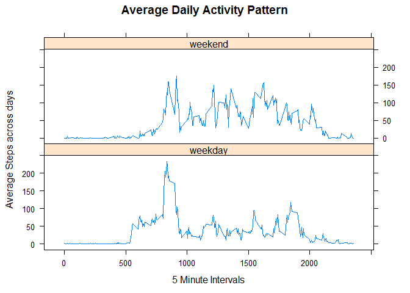

# Reproducible Research: Peer Assessment 1

## Loading and preprocessing the data

To begin this study, the reader will need to load a few libraries. If you have not installed them you will need to install ggplot, gridExtra and dplyr using:
These installs must be done manually by the reader himself


```r
rawData<-read.csv("activity.csv")
str(rawData)
```

```
## 'data.frame':	17568 obs. of  3 variables:
##  $ steps   : int  NA NA NA NA NA NA NA NA NA NA ...
##  $ date    : Factor w/ 61 levels "2012-10-01","2012-10-02",..: 1 1 1 1 1 1 1 1 1 1 ...
##  $ interval: int  0 5 10 15 20 25 30 35 40 45 ...
```
It can be seen that there are a lot of NA in the steps field. This needs some clean up and will be addressed later. The raw data has steps stored in integer format, date as factor and interval as a coded integer in HHMM format. In ideal scenario we need to modify the date and time format of these variables, but for out analysis we let date and time to take the values as is. To make some basic transformations of variables, it would be useful to have dplyr library loaded. Made the following transformations to plot a histogram of the total number ot steps taken each day.


```r
library(dplyr)
```

```
## 
## Attaching package: 'dplyr'
## 
## The following object is masked from 'package:stats':
## 
##     filter
## 
## The following objects are masked from 'package:base':
## 
##     intersect, setdiff, setequal, union
```

```r
by_date <- group_by(rawData, date)
totalsteps_by_date <- summarise(by_date, sum(steps, na.rm=TRUE))
names(totalsteps_by_date)<-c("date", "steps")
hist(totalsteps_by_date$steps, main="Histogram of Total Number of Steps taken each Day", xlab="Total Steps")
```

 

## What is mean total number of steps taken per day?

To obtain the total number of steps taken per day I grouped the dataset by date and took the total on the number of steps taken for each day.


```r
meanSteps <- mean(totalsteps_by_date$steps)
medianSteps <- median(totalsteps_by_date$steps)
```

The Mean total number of steps taken per day is 9354.2295
The Median total number of steps taken per day is 10395


## What is the average daily activity pattern?

To obtain the total daily activity pattern, I grouped the dataset by interval and took the average on the number of steps taken for each interval. I used type="l" to plot the time series of the average steps taken per interval acrross all days


```r
by_interval <- group_by(rawData, interval)
mean_by_interval <- summarise(by_interval, mean(steps, na.rm=TRUE))
names(mean_by_interval)<-c("interval", "Average_Steps")
plot(mean_by_interval$interval, mean_by_interval$Average_Steps, type="l", xlab="5 Minute Intervals", ylab="Average Steps across days", main="Average Daily Activity Pattern")
```

 

```r
maxIndex<-which.max(mean_by_interval$Average_Steps)
maxAvgInterval <- mean_by_interval[maxIndex,]$interval
```

On average across all the days in the dataset,835  contains the maximum number of steps.

## Imputing missing values
To fill in the missing values for the steps, I used the strategy of picking up the mean of the step values corresponding to the intervals from remaining of the data set. To help this I wrote a function getmeanStepsforInterval


```r
getmeanStepsforInterval<- function(x){
    x[["steps"]] <- filter(mean_by_interval, interval == as.integer(x[["interval"]]))$Average_Steps
}
naRows<-is.na(rawData$steps)
beforeFillingNa<-sum(is.na(rawData$steps))
formatData<-read.csv("activity.csv")
formatData[naRows,]$steps<-apply(rawData[naRows,], 1, function(x) getmeanStepsforInterval(x))
afterFillingNa<-sum(is.na(rawData$steps))
```

There were 2304 missing elements in the data set.

This new data thus gives a more accurate insights on the activity pattern.

```r
by_date_fd <- group_by(formatData, date)
totalsteps_by_date_fd <- summarise(by_date_fd, sum(steps, na.rm=TRUE))
names(totalsteps_by_date_fd)<-c("date", "steps")
hist(totalsteps_by_date_fd$steps, main="Histogram of Total Number of Steps Per Day in New Data without NA", xlab="Total Steps")
```

 


```r
meanSteps_fd <- mean(totalsteps_by_date_fd$steps)
medianSteps_fd <- median(totalsteps_by_date_fd$steps)
```

The Mean total number of steps taken per day in the new dataset with no NA is 1.0766 &times; 10<sup>4</sup> .
The Median total number of steps taken per day in the new dataset with no NA is 1.0766 &times; 10<sup>4</sup>. We can find the data to be normalized and the mean to be equal to the median.

## Are there differences in activity patterns between weekdays and weekends?

To find the difference in activity pattern between weekday and weekends, i created a new variable called weekday by using weekday() function. Later calculated the average steps per interval with weekday as the factor. The code for it is given below.


```r
newDataWithDay<-mutate(rawData, day=weekdays(as.Date(rawData$date)))
wekdayOrWeekend<- function(x){
if(x[["day"]]=="Saturday" || x[["day"]]=="Sunday")
f <- "weekend"
else
f<-"weekday"
f
}
newDataWithWeekday<-mutate(newDataWithDay, weekday_Weekend = apply(newDataWithDay, 1, function(x) wekdayOrWeekend(x)))
newDataWeekday<-filter(newDataWithWeekday, weekday_Weekend == "weekday")
newDataWeekend<-filter(newDataWithWeekday, weekday_Weekend == "weekend")
by_interval_wd <- group_by(newDataWeekday, interval)
mean_by_interval_wd <- summarise(by_interval_wd, mean(steps, na.rm=TRUE))
names(mean_by_interval_wd)<-c("interval", "Average_Steps")
by_interval_we <- group_by(newDataWeekend, interval)
mean_by_interval_we <- summarise(by_interval_we, mean(steps, na.rm=TRUE))
names(mean_by_interval_we)<-c("interval", "Average_Steps")
mean_by_interval_we<-mutate(mean_by_interval_we, Day="weekend")
mean_by_interval_wd<-mutate(mean_by_interval_wd, Day="weekday")
mean_by_interval_bind<-rbind(mean_by_interval_we, mean_by_interval_wd)
mean_by_interval_bind$Day <- as.factor(mean_by_interval_bind$Day)
```

To plot the data I used lattice plot and factored the plot on the variable weekday as follows.


```r
library(lattice)
xyplot(Average_Steps ~ interval | Day, type="l", xlab="5 Minute Intervals", ylab="Average Steps across days", main="Average Daily Activity Pattern", data = mean_by_interval_bind, layout = c(1, 2))
```

 
